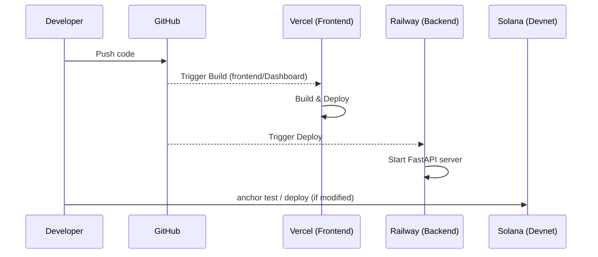

# Mythos - Deployment Guide

## Stack

| Layer | Service | Notes |
|---|---|---|
| Frontend | Vercel | Vite/React app |
| Backend | Railway | FastAPI + Groq + Helius |
| Anchor Program | Solana Devnet | Already deployed |



---

## Frontend -> Vercel

```bash
cd frontend/Dashboard
npm run build          # verify build passes locally first
```

Then push to GitHub and connect the repo to Vercel:

1. Go to [vercel.com/new](https://vercel.com/new)
2. Import `Proj_Mythos` repo
3. **Root directory**: `frontend/Dashboard`
4. **Build command**: `npm run build`
5. **Output directory**: `dist`
6. Set environment variables:
   ```
   VITE_API_URL=https://your-railway-url.up.railway.app
   VITE_SOLANA_NETWORK=devnet
   VITE_HELIUS_API_KEY=your_helius_key
   VITE_MYTHOS_PROGRAM_ID=9Mo1trt6n5dvx1fE92hBsqiberkdtuVcsajS6iVyS8Mr
   VITE_USDC_MINT=4zMMC9srt5Ri5X14GAgXhaHii3GnPAEERYPJgZJDncDU
   ```
7. Deploy -> get your Vercel URL

---

## Backend -> Railway

1. Go to [railway.app](https://railway.app) -> New Project -> Deploy from GitHub
2. Select `Proj_Mythos` repo
3. Start command: uvicorn backend.api.main:app --host 0.0.0.0 --port $PORT
4. Set environment variables:
   ```
   HELIUS_API_KEY=your_helius_key
   GROQ_API_KEY=your_groq_key
   SOLANA_NETWORK=devnet
   MYTHOS_PROGRAM_ID=9Mo1trt6n5dvx1fE92hBsqiberkdtuVcsajS6iVyS8Mr
   USDC_MINT=4zMMC9srt5Ri5X14GAgXhaHii3GnPAEERYPJgZJDncDU
   SOLANA_DEMO_MODE=true
   PORT=8000
   ```
5. Deploy -> get your Railway URL
6. Paste Railway URL into Vercel `VITE_API_URL`

---

## Verify Deployment

```bash
# Backend
curl https://your-railway-url.up.railway.app/health
# -> {"status":"ok","network":"devnet","program":"9Mo1trt6n5dvx1fE92hBsqiberkdtuVcsajS6iVyS8Mr"}

# Price feed
curl https://your-railway-url.up.railway.app/api/solana/price/SOL
# -> {"price": 145.23, "source": "jupiter"}
```

---

## Anchor Program (already deployed on Devnet)

Program ID: `9Mo1trt6n5dvx1fE92hBsqiberkdtuVcsajS6iVyS8Mr`

To redeploy after code changes:

```bash
$env:CARGO_TARGET_DIR = "D:\DevTools\cargo-target"   # Windows
cargo-build-sbf --manifest-path programs/mythos/Cargo.toml
solana program deploy target/deploy/mythos.so \
  --program-id 9Mo1trt6n5dvx1fE92hBsqiberkdtuVcsajS6iVyS8Mr \
  --url devnet \
  --keypair ~/.config/solana/id.json
```
