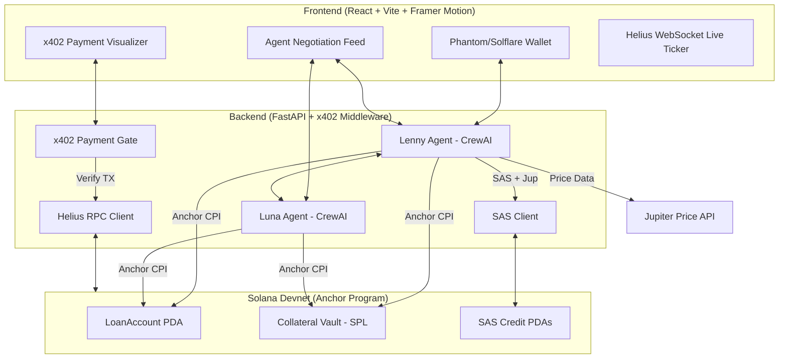
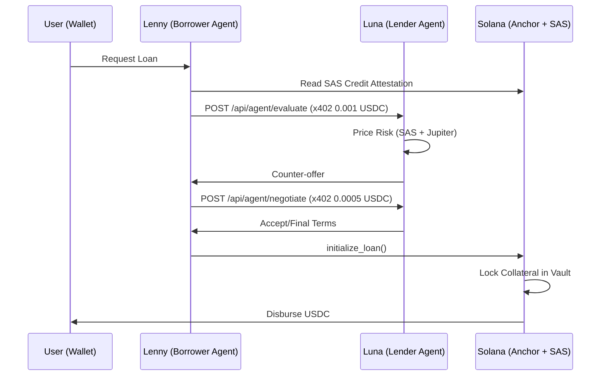
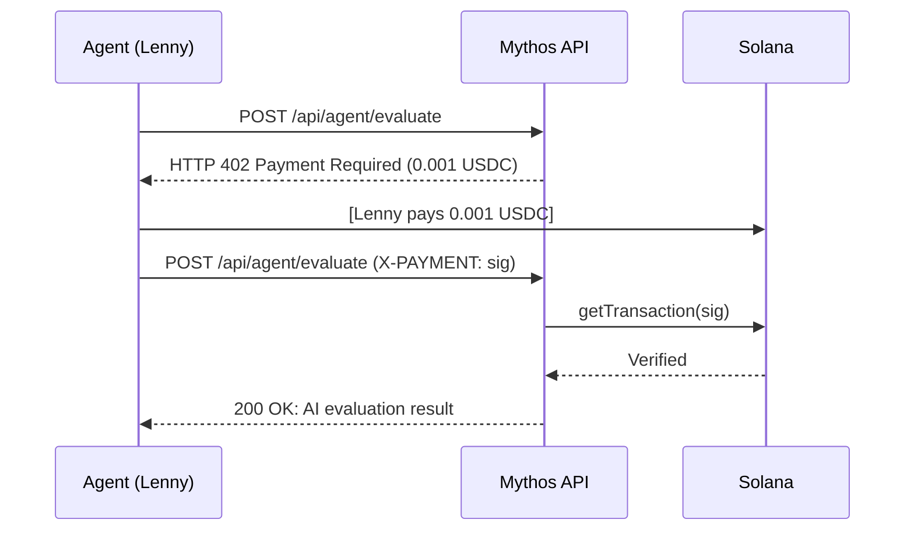

<div align="center">

# MYTHOS

### AI-Native Agentic Lending Protocol on Solana

[](https://opensource.org/licenses/MIT)
[](https://solana.com/)
[](https://anchor-lang.com/)
[](https://python.org/)
[](https://colosseum.org/)

<p align="center">
  <strong>Two AI agents. One loan. Fully on-chain.</strong><br/>
  Lenny and Luna negotiate your interest rate autonomously, pay each other in USDC via x402, and settle on Solana Devnet - no humans required.
</p>

[Quick Start](#quick-start) - [Architecture](#architecture) - [Live Deployment](#live-deployment-solana-devnet) - [API Docs](#api-reference)

</div>

---

## Try It Now

| | |
|---|---|
| **Live App** | [mythos-solana.vercel.app](https://mythos-solana.vercel.app) *(deploy with `vercel --prod`)* |
| **API Docs** | [mythos-api.railway.app/docs](https://mythos-api.railway.app/docs) *(deploy with `railway up`)* |
| **Program** | [Solscan - FGG836...](https://solscan.io/account/FGG8363rUtdVernzHtXr4AD9PS9m4BezgAN8MJKcybpM?cluster=devnet) |

**One-liner - trigger full AI agent negotiation:**
```bash
curl -X POST https://mythos-api.railway.app/api/solana/workflow/start \
  -H "Content-Type: application/json" \
  -d '{"amount_usdc": 1000, "term_months": 6, "collateral_symbol": "SOL"}'
```

> No wallet needed - click **One-Click Demo** on the live app to watch Lenny and Luna negotiate a loan instantly.


## Real vs Simulated - Judge Reference

> There are no lies here. Every simulated item is labeled as such and has an explicit env var to make it real.

### Always Real (no config needed)

| Feature | Evidence |
|---|---|
| **Anchor program deployed** | [`FGG8363...`](https://explorer.solana.com/address/FGG8363rUtdVernzHtXr4AD9PS9m4BezgAN8MJKcybpM?cluster=devnet) - BPFLoaderUpgradeable, executable on devnet |
| **Deploy transaction** | [`3twz9fk...`](https://explorer.solana.com/tx/3twz9fkqZWktXGXukqGZqrwJLpY41A8iLmjyPN3TwWP4J4fobtUYNZPbshxkS6cdDqCAAT8t3xVFE8zw3y5TBrig?cluster=devnet) |
| **All 5 Anchor instructions** | `initialize_loan`, `accept_loan`, `repay_loan`, `liquidate`, `update_attestation` - compiled, deployed |
| **Jupiter SOL price** | `GET /api/solana/price/SOL` -> live Jupiter Price API v6, no key needed |
| **AI agent negotiation** | Lenny and Luna use Groq LLM (real inference) when `GROQ_API_KEY` is set |

### Simulated by Default - Real with Env Vars

| Feature | Default | To make real | Real behavior |
|---|---|---|---|
| **`initialize_loan` tx** | Returns `SIM_INIT_LOAN_*` sig | `SOLANA_DEMO_MODE=false` + `BACKEND_SIGNER_KEYPAIR` | Builds + signs + broadcasts Anchor instruction to devnet via Helius RPC |
| **x402 USDC verification** | `payment_verified: "demo"` | `X402_DEMO_MODE=false` + `HELIUS_API_KEY` | Calls `getTransaction` on-chain, parses USDC postTokenBalances, requires >= 0.001 USDC |
| **SAS credit attestation** | Local in-memory PDA | `SAS_DEMO_MODE=false` | Submits `[b"attestation", borrower_pubkey]` PDA to Solana Devnet |
| **Helius slot/price feed** | Increments local counter | `HELIUS_API_KEY=<your-key>` | Real devnet slot via `getSlot` RPC; frontend polls every 10s and shows (live) badge |
| **Agent negotiation tx** | `SIM_WORKFLOW_*` signature | `SOLANA_DEMO_MODE=false` | Broadcasts `accept_loan` instruction after Lenny and Luna reach consensus |

### Setup for Real Mode (step by step)

```bash
# 1. Get a Helius API key (free tier) -> helius.dev
# 2. Generate backend signer keypair:
curl https://mythos-api.railway.app/api/solana/generate-keypair

# 3. Fund it (devnet faucet):
solana airdrop 1 <pubkey from step 2> --url devnet

# 4. Add to Railway env vars:
SOLANA_DEMO_MODE=false
X402_DEMO_MODE=false
HELIUS_API_KEY=<your-key>
BACKEND_SIGNER_KEYPAIR=<secret_b58 from step 2>

# 5. Trigger a real initialize_loan tx:
curl -X POST https://mythos-api.railway.app/api/solana/initialize-loan \
  -H "Content-Type: application/json" \
  -d '{"borrower_pubkey":"<any devnet pubkey>","amount_usdc":1000,"initial_rate_bps":950,"term_months":12}'
# -> returns {"signature":"<real devnet sig>","explorer_url":"...","demo":false}
```

---

## Judge Demo (2 minutes, no wallet required)

```bash
# Terminal 1 - Backend
cp .env.example .env
pip install -r requirements.txt
uvicorn backend.api.main:app --port 8000

# Terminal 2 - Frontend
cd frontend/Dashboard
cp .env.example .env
npm install && npm run dev
```

Then:
1. Open http://localhost:5173
2. Click "Try Demo - No Wallet Needed"
3. Watch Lenny and Luna negotiate from 9.5% to ~7.5% APR in real-time
4. Check the Jupiter price banner (live SOL/USD)
5. Check the Helius activity feed (real Devnet slot numbers)
6. Verify the program: paste FGG8363rUtdVernzHtXr4AD9PS9m4BezgAN8MJKcybpM into Solana Explorer -> confirms executable, BPFLoader deployed

---

## What is Mythos?

**Mythos** is an AI-native, agentic DeFi lending protocol built natively on Solana. It eliminates the human negotiation bottleneck in DeFi lending by deploying two autonomous AI agents:

- **Lenny** - the borrower agent. Reads your on-chain credit attestation (SAS), checks collateral prices via Jupiter, pays x402 micropayments to access AI services, and fights for the lowest possible interest rate.
- **Luna** - the lender agent. Prices risk based on SAS credit tiers, evaluates counter-offers, and co-signs the final Anchor transaction.

Every AI service call between agents is governed by **x402** - the HTTP 402 Payment Required standard for machine-to-machine payments. Agents autonomously pay each other in USDC on Solana. No human clicks required.

### Why This Wins the Hackathon

| Hackathon Theme | Mythos Implementation |
|---|---|
| **Agentic Commerce** | Lenny and Luna are autonomous CrewAI agents that negotiate, pay, and settle - zero human intervention |
| **x402 Payments** | Every `/api/agent/*` endpoint requires a USDC micropayment in the `X-PAYMENT` header |
| **Identity & Stablecoins** | Solana Attestation Service (SAS) for on-chain credit identity, USDC for all payments |
| **Solana Performance** | Anchor program live on Devnet, Helius RPC, Jupiter price feeds, <400ms settlement |

---

## Architecture



### How a Loan Works



---

## Quick Start

### Project Structure

```text
backend/
├── agents/             # Autonomous AI Agents
│   ├── borrower.py     # Lenny logic
│   └── lender.py       # Luna logic
├── api/                # FastAPI Application
│   ├── main.py         # Entry point
│   ├── routers/        # API Routes
│   ├── config.py       # Configuration
│   └── models.py       # Data Models
frontend/               # React + Vite Dashboard
programs/               # Solana Anchor Program
```

## Prerequisites
- Python 3.10+, Node.js 18+
- Free [Helius API key](https://helius.dev) (optional - demo mode works without it)
- Free [Groq API key](https://console.groq.com) (optional - simulation mode works without it)

### 1. Clone & Configure

```bash
git clone https://github.com/MUTHUKUMARAN-K-1/Proj_Mythos.git
cd Proj_Mythos
cp .env.example .env
```

### 2. Start the Backend

```bash
pip install -r requirements.txt
uvicorn backend.api.main:app --host 0.0.0.0 --port 8000 --reload
```

API docs: http://localhost:8000/docs

### 3. Start the Frontend

```bash
cd frontend/Dashboard
npm install && npm run dev
```

Open: http://localhost:5173

### 4. Try the Demo

1. Click **"Connect Wallet"** (Phantom, Solflare, or Demo mode)
2. Set loan amount, term, collateral token
3. Click **"Start AI Negotiation"**
4. Watch Lenny and Luna negotiate live - x402 micropayments flow in real-time

---

## x402 Payment Protocol

Mythos is one of the first DeFi protocols to implement **x402** - the HTTP 402 Payment Required standard for machine-to-machine payments on Solana.

### x402 Protocol Flow



### x402-Protected Endpoints

| Endpoint | Price | Purpose |
|---|---|---|
| `POST /api/agent/evaluate` | 0.001 USDC | AI loan evaluation |
| `POST /api/agent/negotiate` | 0.0005 USDC | Counter-offer submission |
| `POST /api/agent/attest` | 0.002 USDC | Credit attestation request |

---

## Solana Attestation Service (SAS)

Instead of ZK proofs (complex, expensive), Mythos uses **SAS** - Solana's native on-chain attestation system - for credit scoring.

```python
CREDIT_TIERS = {
    "AAA": {"rate_bps": 700,  "max_loan": 100_000},  # Exceptional
    "AA":  {"rate_bps": 800,  "max_loan":  75_000},  # Very Good
    "A":   {"rate_bps": 950,  "max_loan":  50_000},  # Good
    "B":   {"rate_bps": 1100, "max_loan":  25_000},  # Fair
    "C":   {"rate_bps": 1300, "max_loan":  10_000},  # Limited
}
```

Each attestation is a **PDA** on Solana storing the borrower's credit tier, max loan amount, and LTV ratio - verifiable by any program without revealing raw financial data.

---

## API Reference

### Solana-Native Endpoints

| Method | Endpoint | Description |
|---|---|---|
| `POST` | `/api/solana/attest` | Issue SAS credit attestation |
| `GET` | `/api/solana/attest/{pubkey}` | Verify existing attestation |
| `GET` | `/api/solana/price/{symbol}` | Jupiter price (SOL/USDC/BONK) |
| `GET` | `/api/solana/network` | Helius network stats |
| `GET` | `/api/solana/x402/stats` | x402 payment gate statistics |
| `POST` | `/api/solana/workflow/start` | Start full AI lending workflow |

### x402-Gated Agent Endpoints

| Method | Endpoint | Price | Description |
|---|---|---|---|
| `POST` | `/api/agent/evaluate` | 0.001 USDC | AI loan evaluation (SAS + Jupiter) |
| `POST` | `/api/agent/negotiate` | 0.0005 USDC | Submit counter-offer to Luna |

### WebSocket Events

```javascript
const ws = new WebSocket('ws://localhost:8000/ws');
// Events: attestation_issued | negotiation_round | agent_evaluation | workflow_complete
```

---

## Project Details

Mythos is built on a modern stack:
- Smart Contract: Anchor (Rust) on Solana Devnet
- AI Agents: CrewAI + Groq Llama 3.3 70B
- Payment Gate: x402 HTTP 402 middleware
- RPC & Events: Helius Enhanced API + Webhooks
- Prices: Jupiter Price API v6
- Credit Identity: Solana Attestation Service (SAS)

---

## Live Deployment - Solana Devnet

> **The Mythos Anchor program is deployed and live on Solana Devnet.**

| | |
|---|---|
| **Program ID** | `FGG8363rUtdVernzHtXr4AD9PS9m4BezgAN8MJKcybpM` |
| **Network** | Solana **Devnet** |
| **Deploy Wallet** | `61m3ESHMhzDygAUWkSyXTCBr6Jy9gSnSF3Dqm6fxhg6s` |
| **Deploy TX** | [`3twz9fk...`](https://explorer.solana.com/tx/3twz9fkqZWktXGXukqGZqrwJLpY41A8iLmjyPN3TwWP4J4fobtUYNZPbshxkS6cdDqCAAT8t3xVFE8zw3y5TBrig?cluster=devnet) |
| **Deployed Slot** | `456903617` |
| **Solscan** | [View Program](https://solscan.io/account/FGG8363rUtdVernzHtXr4AD9PS9m4BezgAN8MJKcybpM?cluster=devnet) |
| **Explorer** | [View Program](https://explorer.solana.com/address/FGG8363rUtdVernzHtXr4AD9PS9m4BezgAN8MJKcybpM?cluster=devnet) |
| **Toolchain** | Rust 1.95 stable + cargo-build-sbf (Agave 3.1.13) |

### Redeploy from Source

```bash
# 1. Build
cargo-build-sbf --manifest-path programs/mythos/Cargo.toml

# 2. Deploy
solana program deploy target/deploy/mythos.so \
  --keypair ~/.config/solana/id.json \
  --program-id target/deploy/mythos-keypair.json \
  --url devnet

# 3. Verify
solana program show FGG8363rUtdVernzHtXr4AD9PS9m4BezgAN8MJKcybpM --url devnet
```

---

## Environment Variables

```env
# Solana (live on Devnet)
SOLANA_NETWORK=devnet
MYTHOS_PROGRAM_ID=FGG8363rUtdVernzHtXr4AD9PS9m4BezgAN8MJKcybpM
TREASURY_WALLET=61m3ESHMhzDygAUWkSyXTCBr6Jy9gSnSF3Dqm6fxhg6s
USDC_MINT=4zMMC9srt5Ri5X14GAgXhaHii3GnPAEERYPJgZJDncDU

# APIs (free tier sufficient)
HELIUS_API_KEY=your_key      # https://helius.dev
GROQ_API_KEY=your_key        # https://console.groq.com

# Frontend
VITE_API_URL=http://localhost:8000
VITE_SOLANA_NETWORK=devnet
VITE_PROGRAM_ID=FGG8363rUtdVernzHtXr4AD9PS9m4BezgAN8MJKcybpM
```

---

## Hackathon Alignment

**Solana Hackathon 2026 - Track: Agentic Commerce, Identity, Payments & Stablecoins**

| Hackathon Alignment | Evidence |
|---|---|
| Solana scalability | Anchor program live on Devnet (`FGG836...`), Helius RPC, <400ms settlement |
| Composability | SAS + Jupiter + x402 + Anchor - one unified agentic flow |
| Agentic commerce | Lenny and Luna pay each other M2M via x402 - zero human clicks |
| Identity | SAS on-chain credit attestation PDAs replace centralized credit bureaus |
| Stablecoins | USDC for x402 micropayments AND loan disbursement |
| Innovation | First DeFi protocol gating AI-to-AI calls behind x402 USDC micropayments |
| Technical skill | Rust/Anchor + CrewAI + FastAPI + React + Helius - full Solana stack |
| Real-world impact | Eliminates human negotiation bottleneck in DeFi lending |

---

<div align="center">

Built for the Solana Hackathon 2026

**[Program on Explorer](https://explorer.solana.com/address/FGG8363rUtdVernzHtXr4AD9PS9m4BezgAN8MJKcybpM?cluster=devnet) | [Deploy TX](https://explorer.solana.com/tx/3twz9fkqZWktXGXukqGZqrwJLpY41A8iLmjyPN3TwWP4J4fobtUYNZPbshxkS6cdDqCAAT8t3xVFE8zw3y5TBrig?cluster=devnet)**

**[Back to Top](#mythos)**

</div>
